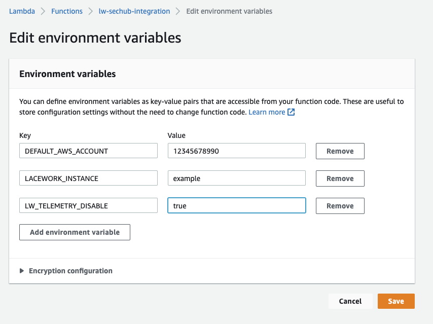

# Lacework AWS Security Hub Integration


## Overview
The Lacework integration with AWS Security Hub pushes cloud security events from the Lacework Polygraph Data Platform (PDP) to Security Hub, allowing an 
organization the capability to manage all of their AWS posture and compliance events from a single, consolidated view.
---
## How It Works
The Lacework AWS Security Hub integration uses multiple self-hosted AWS components that will transform a Lacework 
Cloudwatch/Eventbridge alert into a Security Hub finding. This is done by the following components: Eventbridge, SQS and 
Lambda. 


### Lacework Event to Security Hub Finding

1. PDP sends an event to AWS Eventbridge via the Cloudwatch Alert Channel.
2. Eventbridge forwards the event to an SQS queue.
3. The SQS queue triggers the Lambda function.
4. The Lambda function transforms the finding(s) and sends them to Security Hub.
---
## Prerequisites
You need the following prerequisites to implement the Lacework AWS Security Hub integration.

- AWS Security Hub 
- An AWS Subscription to the Lacework AWS Security Hub product.
- A Lacework Polygraph Data Platform SaaS account. 
---
## Installing the Lacework AWS Security Hub Integration

### 1. Deploy the Lacework AWS Security Hub Integration with Terraform

1. Download and extract the [Terraform Deployment Package](https://lacework-alliances.s3.us-west-2.amazonaws.com/lacework-aws-security-hub/terraform/lacework_security_hub.zip)
2. Change directory to **lacework_security_hub/deploy/terraform**
3. Determine your Lacework instance authentication method (lacework-cli or API key)  
   **lacework-cli**
   1. Chose the proper profile from the ~/.lacework.toml file, in this case the [default] profile
   ```toml
   [default]
   account = "example"
   api_key = "EXAMPLE_2222D32AE4750727928E7C84055AAD67C96D8EEED25E3A1"
   api_secret = "_b33ec45d56756tghy46def2321"
   version = 2
   ```
   2. Open the *main.tf* file
   3. Modify the Lacework Terraform provider configuration with the above profile
   ```terraform
   provider "lacework" {
     profile = "default"
   }
   ```  
   **API key**
   1. In your Lacework console, go to **Settings > API Keys**.
   2. Click on the **Create New** button in the upper right to create a new API key.
   3. Provide a **name** and **description** and click Save.
   4. Click the download button to download the API keys file.
   5. Copy the **keyId** and **secret** from this file.
   ```terraform
   provider "lacework" {
     account = local.lw_instance
     api_key = "EXAMPLE_2222D32AE4750727928E7C84055AAD67C96D8EEED25E3A1"
     api_secret = "_b33ec45d56756tghy46def2321"
   }
   ```
4. Modify the required local variables 
   ```terraform
    # Lacework instance: example.lacework.net
     lw_instance = "example"
     # aws_region sets the region for integration deployment (should be the same as your Security Hub instance)
     aws_region = "us-west-2"
     # default_account is the main AWS account id that unknown data sources will be mapped to in Security Hub
     default_account = "1234567890"
     # customer_accounts is the array of customer's AWS accounts that are configured in Lacework,
     customer_accounts = [local.default_account, "2345678901", "3456789012"]
   ```
5. Run *terraform init* -> *terraform plan* -> *terraform apply*

### 2. Deploy the Lacework AWS Security Hub Integration with CloudFormation

1. Login in to AWS master account with Administrator permissions.
   Click on the following Launch Stack button to go to your CloudFormation console and launch the AWS Control Integration template.

   [](https://console.aws.amazon.com/cloudformation/home?#/stacks/create/review?templateURL=https://lacework-alliances.s3.us-west-2.amazonaws.com/lacework-aws-security-hub/templates/aws-security-hub-integration.yml)

   For most deployments, you only need the Basic Configuration parameters. Use the Advanced Configuration for customization.
   
3. Specify the following Basic Configuration parameters:
   * Enter a **Stack name** for the stack.
   * Enter **Your Lacework URL**.
   * Enter your **Lacework Sub-Account Name** if you are using Lacework Organizations.
   * Enter your **Lacework Access Key ID** and **Secret Key** that you copied from your previous API Keys file.
   * Enter a **Resource Prefix Name** for the AWS resources that will be created.
   * For **Customer Accounts**, enter a comma-separated list of AWS Accounts IDs that are monitored by Lacework.
   * Choose whether you want to **Create Lacework Alert Channel**. This will create the Lacework alert channel and rule.
   * Enter the **Alert Channel Name**.
4. Click **Next** through to your stack **Review**.
5. Accept the AWS CloudFormation terms and click **Create stack**.

### 3. Validate the Lacework AWS Security Hub Integration

1. Login to your Lacework Cloud Security Platform console.
2. Go to **Settings > Alert Channels**.
3. You should see an alert channel with the name `lw-sechub-integration` and a status of **Success**.
4. If the status shows **Integration Pending** please click the **TEST INTEGRATION** button.
---
## Remove the Lacework AWS Security Hub Integration
You can use your chosen deployment method to remove the integration (Terraform, Cloudformation).

**NOTE** This will remove all AWS components and the Lacework Alert Channel and Rule.
---
## Permissions

### AWS Roles
lw-sechub-role
```
{
    "Version": "2012-10-17",
    "Statement": [
      {
        "Effect": "Allow",
        "Principal": {
          "Service": "lambda.amazonaws.com"
        },
        "Action": "sts:AssumeRole"
      }
    ]
  }
```

### Policies
lw-sechub-batchimport
```
{
    Version = "2012-10-17"
    Statement = [
      {
        Action = [
          "securityhub:BatchImportFindings",
        ]
        Effect   = "Allow"
        Resource = arn:aws:securityhub:<REGION>::product/lacework/lacework"
      },
    ]
  }
```
---
## Troubleshooting
The following sections provide guidance for resolving issues with deploying the Lacework AWS Security Hub integration.


### Lambda Function CloudWatch Logs

The Lambda function that gets deployed will have a cloudwatch log associated with it in the same region it was deployed. You can use this log stream
to check the status of your integration. It will have the following naming format: `/aws/lambda/lw-sechub-integration`

### Lacework API Access Keys
The AWS Security Hub integration requires Lacework API credentials in order to automate the creation of the Alert Channels and Alert Rules during the deployment.

### Telemetry
By default, the Lacework AWS Security Hub Integration sends error messages to an instance of honeycomb.io in order to
track issues with findings and use this telemetry to continuously update the event to finding algorithms.  
If you would like to **DISABLE** the telemetry:
1. In your AWS Console navigate to the *lw-sechub-integration* Lambda function
2. Navigate to the *Configuration*->*Environment variables* section
3. Select *Edit*->*Add Environment Variable*
4. Enter the following key: **LW_DISABLE_TELEMETRY** and value: **true**  

---
## FAQ

* Do I need to subscribe all my AWS accounts to the Lacework Security Hub product ARN?
The short answer is *yes*. You will need a subscription for each account that will send events from Lacework to Security Hub.
---

## Reference Documentation